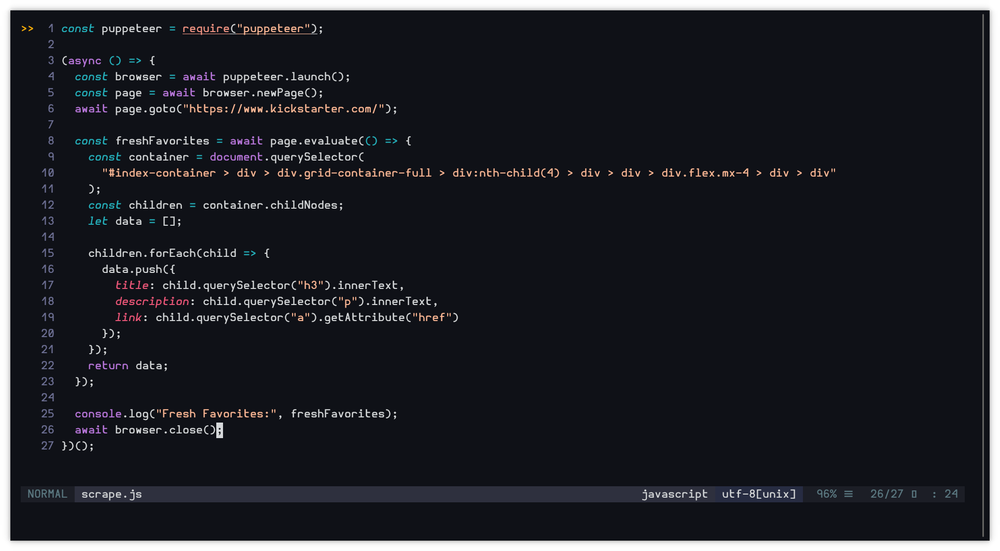
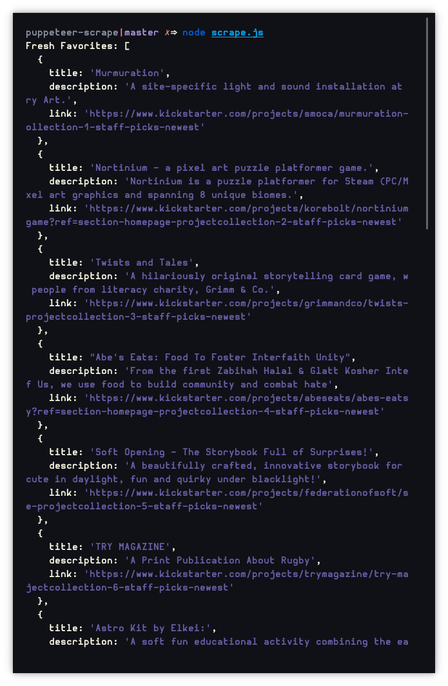

# Scraping with Puppeteer

An example of scraping Kickstarter.com for their 'Fresh Favorites' list.
(Detailed comment in source)

### At a glance

### Sample output


## Try it for yourself

To test this example you will need NodeJS installed on your system.

 Clone repository
```
git clone https://github.com/Cheston/puppeteer-scraping.git
```

Install dependencies
```
npm install
```

Run scrape.js
```
node scrape.js
```
